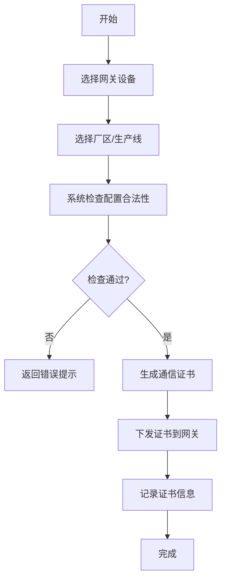
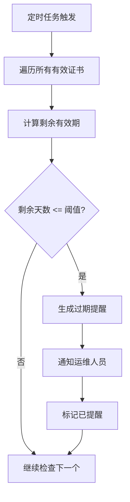
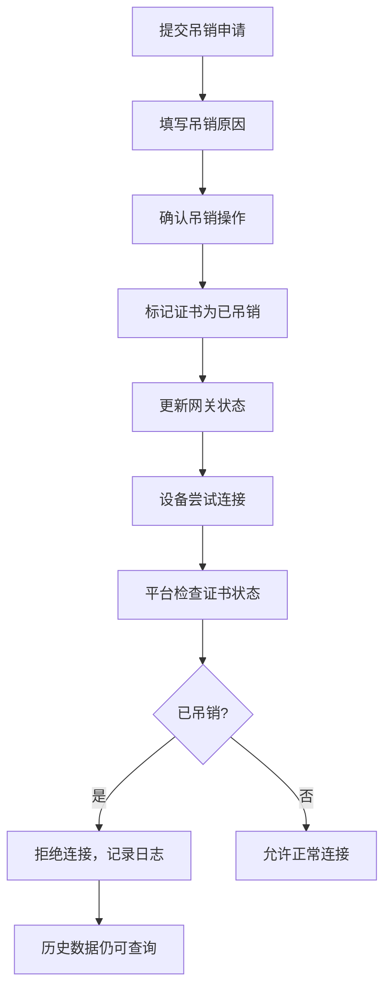

## 1. 产品概述

工控网关证书下发台是面向工业控制系统的安全管理平台，为厂区内的边缘网关设备提供通信证书的全生命周期管理，确保设备接入平台的安全性和可追溯性。

- 主要用途：边缘网关设备通信证书的申请、颁发、吊销、过期提醒及状态监控
- 解决问题：工业设备接入安全管控、证书过期风险预警、吊销设备拦截、历史数据追溯
- 目标用户：运维管理人员、安全审计人员
- 产品价值：提升工业网络安全性，降低设备证书管理成本，满足合规审计要求

## 2. 核心功能

### 2.1 用户角色

| 角色 | 注册方式 | 核心权限 |
|------|----------|----------|
| 运维管理员 | 账号分配 | 证书申请、颁发、吊销管理，网关设备管理，查看所有数据 |
| 审计人员 | 账号分配 | 查看证书状态、历史操作日志、数据追溯，只读权限 |

### 2.2 功能模块

1. **仪表盘**：证书总览统计、即将过期提醒、吊销设备列表、厂区生产线分布
2. **证书管理**：证书申请、颁发、吊销、状态查询、详情查看
3. **网关设备管理**：网关注册、信息维护、厂区/生产线绑定、在线状态监控
4. **厂区生产线管理**：厂区和生产线的基础信息维护
5. **数据追溯**：吊销设备历史采集数据查询、证书操作审计日志
6. **系统设置**：过期提醒阈值配置、证书有效期默认配置

### 2.3 页面详情

| 页面名称 | 模块名称 | 功能描述 |
|----------|----------|----------|
| 仪表盘 | 统计概览 | 证书总数、有效证书数、即将过期数、已吊销数统计卡片 |
| 仪表盘 | 过期提醒 | 30天内即将过期的证书列表，红色高亮显示 |
| 仪表盘 | 吊销设备 | 已吊销证书的设备列表，显示吊销原因 |
| 证书管理 | 证书列表 | 分页展示所有证书，支持按状态、厂区、生产线筛选 |
| 证书管理 | 证书申请 | 填写网关信息、选择厂区生产线、提交证书申请 |
| 证书管理 | 证书详情 | 展示证书完整信息、有效期、吊销状态、操作历史 |
| 网关管理 | 网关列表 | 展示所有网关设备，显示在线状态、绑定证书状态 |
| 厂区管理 | 厂区列表 | 管理厂区基础信息，关联生产线 |
| 数据追溯 | 历史数据查询 | 按设备、时间范围查询历史采集数据，支持导出 |
| 数据追溯 | 审计日志 | 证书申请、颁发、吊销的操作日志记录 |

## 3. 核心流程

### 3.1 证书申请颁发流程

运维人员为边缘网关申请通信证书，系统自动检查厂区、生产线配置，生成证书并绑定设备。

### 3.2 证书过期提醒流程

系统每日检查证书有效期，对即将过期的证书发送提醒通知。

### 3.3 证书吊销与设备拦截流程

证书吊销后，设备连接时平台自动拦截，但保留历史数据可追溯。

## 4. 用户界面设计

### 4.1 设计风格

- **主色调**：工业蓝（#1e40af）作为主色，代表专业和可信；深灰色（#0f172a）作为背景，营造工业控制氛围
- **辅助色**：橙色（#ea580c）用于过期警告，红色（#dc2626）用于吊销状态，绿色（#16a34a）用于正常状态
- **按钮风格**：直角硬朗风格，带有轻微边框，突出工业感
- **字体**：使用 JetBrains Mono 作为数字和代码展示字体，增强工业系统质感；正文使用 Noto Sans SC
- **布局风格**：顶部导航栏 + 侧边菜单栏 + 内容区的经典工控系统布局，信息密度适中
- **图标风格**：使用 lucide-react 线性图标，保持简洁专业

### 4.2 页面设计概述

| 页面名称 | 模块名称 | UI Elements |
|----------|----------|-------------|
| 仪表盘 | 统计概览 | 深色卡片背景，渐变边框，数字使用等宽字体，悬浮时轻微上移动画 |
| 仪表盘 | 过期提醒 | 橙色警告图标闪烁效果，倒计时数字动态更新 |
| 证书管理 | 证书列表 | 表格布局，状态标签使用不同颜色区分，行悬停高亮 |
| 证书管理 | 证书申请 | 多步骤表单，带进度指示器，表单验证实时反馈 |
| 证书管理 | 证书详情 | 信息卡片分组展示，证书信息使用代码块样式，操作按钮分组 |
| 网关管理 | 网关列表 | 设备在线状态指示灯（绿色闪烁=在线，灰色=离线），卡片式布局 |
| 数据追溯 | 历史数据 | 时间轴样式展示数据记录，支持时间范围选择器，数据表格可导出 |
| 数据追溯 | 审计日志 | 操作记录列表，显示操作人、时间、操作类型，支持筛选 |

### 4.3 响应性

- 采用桌面优先设计，主显示区域最小宽度支持 1366px
- 侧边栏支持折叠，适配不同屏幕尺寸
- 表格支持水平滚动，避免小屏幕下内容挤压
- 触摸设备优化：按钮最小尺寸 44px，重要操作增加二次确认

### 4.4 动效设计

- 页面加载：卡片按顺序淡入，形成瀑布流效果
- 状态变化：证书状态切换时有颜色过渡动画（300ms）
- 警告提示：即将过期的证书有轻微呼吸效果，吸引注意
- 表单交互：输入框聚焦时有边框高亮动画
- 导航切换：侧边栏展开/折叠有平滑过渡效果
