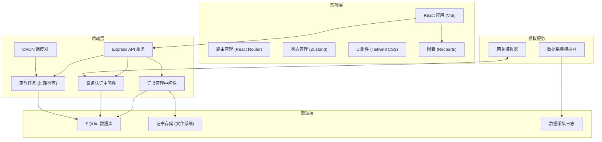
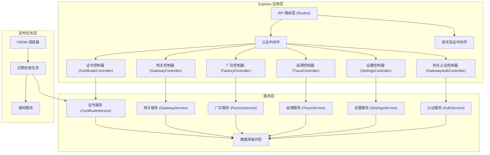
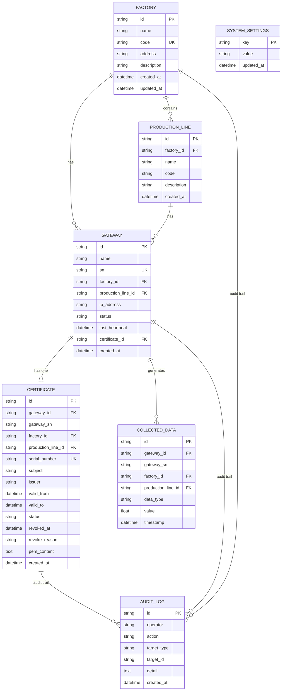

## 1. 架构设计



## 2. 技术描述

- **前端**：React@18 + TypeScript + Vite + TailwindCSS@3 + Zustand + React Router + Recharts + lucide-react
- **初始化工具**：vite-init
- **后端**：Express@4 + TypeScript + node-cron + better-sqlite3
- **数据库**：SQLite（轻量级，便于本地演示，生产环境可替换为PostgreSQL）
- **证书生成**：Node.js crypto 模块模拟 X.509 证书生成

## 3. 路由定义

### 前端路由

| Route | 页面 | 用途 |
|-------|------|------|
| /dashboard | Dashboard 仪表盘 | 证书统计概览、过期提醒、吊销设备列表 |
| /certificates | CertificateList 证书列表 | 证书列表展示、筛选、搜索 |
| /certificates/apply | CertificateApply 证书申请 | 新证书申请表单 |
| /certificates/:id | CertificateDetail 证书详情 | 证书详细信息、操作历史 |
| /gateways | GatewayList 网关列表 | 网关设备管理 |
| /factories | FactoryList 厂区管理 | 厂区和生产线管理 |
| /trace/data | DataTrace 数据追溯 | 历史采集数据查询 |
| /trace/audit | AuditLog 审计日志 | 操作日志查询 |
| /settings | Settings 系统设置 | 过期提醒阈值等配置 |

### API 路由

| Method | Route | 用途 |
|--------|-------|------|
| GET | /api/dashboard/stats | 获取仪表盘统计数据 |
| GET | /api/dashboard/expiring | 获取即将过期的证书 |
| GET | /api/dashboard/revoked | 获取已吊销设备 |
| GET | /api/certificates | 获取证书列表 |
| POST | /api/certificates | 申请新证书 |
| GET | /api/certificates/:id | 获取证书详情 |
| POST | /api/certificates/:id/revoke | 吊销证书 |
| GET | /api/gateways | 获取网关列表 |
| POST | /api/gateways | 注册新网关 |
| GET | /api/factories | 获取厂区列表 |
| POST | /api/factories | 新增厂区 |
| GET | /api/factories/:id/production-lines | 获取厂区生产线 |
| POST | /api/factories/:id/production-lines | 新增生产线 |
| GET | /api/trace/data | 查询历史采集数据 |
| GET | /api/trace/audit | 查询审计日志 |
| GET | /api/gateway/auth | 网关连接认证（内部接口） |
| GET | /api/settings | 获取系统设置 |
| PUT | /api/settings | 更新系统设置 |

## 4. API 类型定义

```typescript
// 公共类型
interface PaginationParams {
  page: number;
  pageSize: number;
}

interface PaginationResponse<T> {
  items: T[];
  total: number;
  page: number;
  pageSize: number;
}

// 厂区
interface Factory {
  id: string;
  name: string;
  code: string;
  address: string;
  description: string;
  createdAt: string;
  updatedAt: string;
}

// 生产线
interface ProductionLine {
  id: string;
  factoryId: string;
  name: string;
  code: string;
  description: string;
  createdAt: string;
}

// 网关设备
interface Gateway {
  id: string;
  name: string;
  sn: string;
  factoryId: string;
  productionLineId: string;
  ipAddress: string;
  status: 'online' | 'offline' | 'revoked';
  lastHeartbeat: string | null;
  certificateId: string | null;
  createdAt: string;
}

// 证书
interface Certificate {
  id: string;
  gatewayId: string;
  gatewaySn: string;
  factoryId: string;
  productionLineId: string;
  serialNumber: string;
  subject: string;
  issuer: string;
  validFrom: string;
  validTo: string;
  status: 'valid' | 'expired' | 'revoked';
  revokedAt: string | null;
  revokeReason: string | null;
  pemContent: string;
  createdAt: string;
}

// 采集数据
interface CollectedData {
  id: string;
  gatewayId: string;
  gatewaySn: string;
  factoryId: string;
  productionLineId: string;
  dataType: string;
  value: number;
  timestamp: string;
}

// 审计日志
interface AuditLog {
  id: string;
  operator: string;
  action: 'create' | 'revoke' | 'update' | 'delete';
  targetType: 'certificate' | 'gateway' | 'factory' | 'settings';
  targetId: string;
  detail: string;
  createdAt: string;
}

// 系统设置
interface SystemSettings {
  expireWarningDays: number;
  defaultCertValidDays: number;
}

// 网关认证响应
interface GatewayAuthResponse {
  allowed: boolean;
  reason?: string;
  certificateStatus?: string;
}
```

## 5. 服务器架构图



## 6. 数据模型

### 6.1 数据模型 ER 图



### 6.2 数据定义语言 (DDL)

```sql
-- 厂区表
CREATE TABLE factories (
    id TEXT PRIMARY KEY,
    name TEXT NOT NULL,
    code TEXT NOT NULL UNIQUE,
    address TEXT,
    description TEXT,
    created_at DATETIME DEFAULT CURRENT_TIMESTAMP,
    updated_at DATETIME DEFAULT CURRENT_TIMESTAMP
);

-- 生产线表
CREATE TABLE production_lines (
    id TEXT PRIMARY KEY,
    factory_id TEXT NOT NULL,
    name TEXT NOT NULL,
    code TEXT NOT NULL,
    description TEXT,
    created_at DATETIME DEFAULT CURRENT_TIMESTAMP,
    FOREIGN KEY (factory_id) REFERENCES factories(id)
);

-- 网关设备表
CREATE TABLE gateways (
    id TEXT PRIMARY KEY,
    name TEXT NOT NULL,
    sn TEXT NOT NULL UNIQUE,
    factory_id TEXT NOT NULL,
    production_line_id TEXT NOT NULL,
    ip_address TEXT,
    status TEXT NOT NULL DEFAULT 'offline',
    last_heartbeat DATETIME,
    certificate_id TEXT,
    created_at DATETIME DEFAULT CURRENT_TIMESTAMP,
    FOREIGN KEY (factory_id) REFERENCES factories(id),
    FOREIGN KEY (production_line_id) REFERENCES production_lines(id)
);

-- 证书表
CREATE TABLE certificates (
    id TEXT PRIMARY KEY,
    gateway_id TEXT NOT NULL,
    gateway_sn TEXT NOT NULL,
    factory_id TEXT NOT NULL,
    production_line_id TEXT NOT NULL,
    serial_number TEXT NOT NULL UNIQUE,
    subject TEXT NOT NULL,
    issuer TEXT NOT NULL,
    valid_from DATETIME NOT NULL,
    valid_to DATETIME NOT NULL,
    status TEXT NOT NULL DEFAULT 'valid',
    revoked_at DATETIME,
    revoke_reason TEXT,
    pem_content TEXT NOT NULL,
    created_at DATETIME DEFAULT CURRENT_TIMESTAMP,
    FOREIGN KEY (gateway_id) REFERENCES gateways(id),
    FOREIGN KEY (factory_id) REFERENCES factories(id),
    FOREIGN KEY (production_line_id) REFERENCES production_lines(id)
);

-- 采集数据表
CREATE TABLE collected_data (
    id TEXT PRIMARY KEY,
    gateway_id TEXT NOT NULL,
    gateway_sn TEXT NOT NULL,
    factory_id TEXT NOT NULL,
    production_line_id TEXT NOT NULL,
    data_type TEXT NOT NULL,
    value REAL NOT NULL,
    timestamp DATETIME NOT NULL,
    FOREIGN KEY (gateway_id) REFERENCES gateways(id)
);

-- 审计日志表
CREATE TABLE audit_logs (
    id TEXT PRIMARY KEY,
    operator TEXT NOT NULL,
    action TEXT NOT NULL,
    target_type TEXT NOT NULL,
    target_id TEXT NOT NULL,
    detail TEXT,
    created_at DATETIME DEFAULT CURRENT_TIMESTAMP
);

-- 系统设置表
CREATE TABLE system_settings (
    key TEXT PRIMARY KEY,
    value TEXT NOT NULL,
    updated_at DATETIME DEFAULT CURRENT_TIMESTAMP
);

-- 索引
CREATE INDEX idx_certificates_status ON certificates(status);
CREATE INDEX idx_certificates_valid_to ON certificates(valid_to);
CREATE INDEX idx_certificates_gateway_id ON certificates(gateway_id);
CREATE INDEX idx_gateways_status ON gateways(status);
CREATE INDEX idx_gateways_factory_id ON gateways(factory_id);
CREATE INDEX idx_collected_data_gateway_id ON collected_data(gateway_id);
CREATE INDEX idx_collected_data_timestamp ON collected_data(timestamp);
CREATE INDEX idx_audit_logs_target ON audit_logs(target_type, target_id);
```

### 6.3 初始数据

```sql
-- 系统默认设置
INSERT INTO system_settings (key, value) VALUES 
('expireWarningDays', '30'),
('defaultCertValidDays', '365');

-- 示例厂区
INSERT INTO factories (id, name, code, address, description) VALUES 
('f1', '华东一号厂区', 'F001', '上海市浦东新区工业路1号', '主要生产电子产品'),
('f2', '华南二号厂区', 'F002', '深圳市南山区科技园路2号', '主要生产机械设备');

-- 示例生产线
INSERT INTO production_lines (id, factory_id, name, code, description) VALUES 
('pl1', 'f1', 'SMT贴片线A', 'PL001', '表面贴装生产线'),
('pl2', 'f1', '组装测试线B', 'PL002', '产品组装与测试'),
('pl3', 'f2', '机械加工线C', 'PL003', '精密零件加工'),
('pl4', 'f2', '焊接生产线D', 'PL004', '自动化焊接');

-- 示例网关
INSERT INTO gateways (id, name, sn, factory_id, production_line_id, ip_address, status) VALUES 
('g1', 'SMT线网关01', 'GW20240001', 'f1', 'pl1', '192.168.1.10', 'online'),
('g2', 'SMT线网关02', 'GW20240002', 'f1', 'pl1', '192.168.1.11', 'online'),
('g3', '组装线网关01', 'GW20240003', 'f1', 'pl2', '192.168.1.20', 'offline'),
('g4', '加工线网关01', 'GW20240004', 'f2', 'pl3', '192.168.2.10', 'online'),
('g5', '焊接线网关01', 'GW20240005', 'f2', 'pl4', '192.168.2.20', 'online');
```
